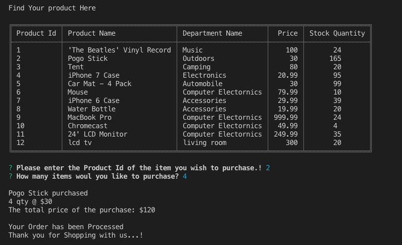
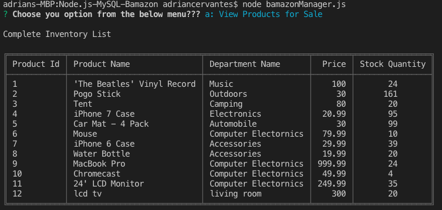
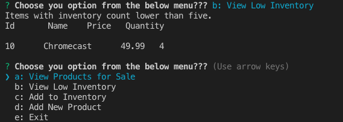
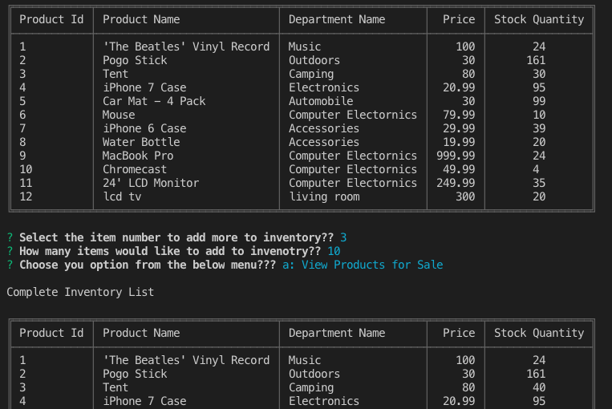
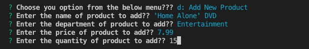

# Node.js-MySQL-Bamazon


A mock storefront with departments and products. Customers, managers, and supervisors are able to use this app.


### What Each Does

1. `BamazonCustomer.js`

    * Prints the products in the store.

    * Prompts customer which product they would like to purchase by ID number.

    * Asks for the quantity.

      * If there is a sufficient amount of the product in stock, it will return the total for that purchase.
      * However, if there is not enough of the product in stock, it will tell the user that there isn't enough of the product.
      * If the purchase goes through, it updates the stock quantity to reflect the purchase.
      * It will also update the product sales in the department MySQL database table.

# Costumer 

-----------------------

2. `BamazonManager.js`

    * Starts with a menu:
        * View Products for Sale
        * View Low Inventory
        * Add to Inventory
        * Add New Product
        * End Session

    * If the manager selects `View Products for Sale`, it lists all of the products in the store including all of their details.
    
 

    * If the manager selects `View Low Inventory`, it'll list all the products with less than five items in its StockQuantity column.
    
  

    * If the manager selects `Add to Inventory`, it allows the manager to select a product and add inventory.
    
  

    * If the manager selects `Add New Product`, it allows the manager to add a new product to the store.
    
   

    * If the manager selects `End Session`, it ends the session and doesn't go back to the menu.

-----------------------

3. `BamazonExecutive.js`

    * Starts with a menu:
        * View Product Sales by Department
        * Create New Department
        * End Session

    * If the manager selects `View Product Sales by Department`, it lists the Department Sales and calculates the total sales from the overhead cost and product sales.

    * If the manager selects `Create New Department`, it allows the manager to create a new department and input current overhead costs and product sales. If there are none, by default it will set at 0.

    * If the manager selects `End Session`, it ends the session and doesn't go back to the menu.

## Technologies used
- Node.js
- Inquire NPM Package (https://www.npmjs.com/package/inquirer)
- MYSQL NPM Package (https://www.npmjs.com/package/mysql)

### Prerequisites

```
- Node.js - Download the latest version of Node https://nodejs.org/en/
- Create a MYSQL database called 'Bamazon', reference schema.sql
```

## Built With

* Visual Studio Code - Text Editor
* MySQL/MySQLWorkbench
* Terminal/Gitbash
>>>>>>> 6899ba9a5dd7eebb30ed706130e483ac09743076
